# Azure Synapse Manufacturing Setup Guide


**Contents**

<!-- TOC -->

- [Azure Synapse Analytics WWI setup guide](#azure-synapse-analytics-wwi-setup-guide)
  - [Requirements](#requirements)
  - [Before Starting](#before-starting)
    - [Task 1: Create a resource group in Azure.](#task-1-create-a-resource-group-in-azure)
    - [Task 2: Power BI workspace creation](#task-2-power-BI-workspace-creation)
    - [Task 3: Deploy the ARM Template](#task-3-deploy-the-arm-template)
    - [Task 4: Run the Cloud Shell](#task-4-run-the-cloud-shell)
    - [Task 5: Power BI reports and Dashboard creation ](#task-5-power-bi-reports-and-dashboard-creation)
    - [Task 6: Working with Power BI for Real Time Report](#task-6-working-with-power-bi-for-real-time-report)
    
<!-- /TOC -->

## Requirements

1. An Azure Account with the ability to create an Azure Synapse Workspace.
2. A Power BI Pro or Premium account to host Power BI reports.

## Before starting

### Task 1: Create a resource group in Azure

1. **Log into** the [Azure Portal](https://portal.azure.com) using your Azure credentials.

2. On the Azure Portal home screen, **select** the **+ Create** a resource tile.

    

3. In the **Search the Marketplace** text box, type **Resource group** and press the **Enter** key.

    

4. **Select** the **Create** button on the **Resource group** overview page.

5. On the **Create a resource group** screen, select your desired Subscription and Region. For Resource group, enter **Synapse-WWI-Lab**, then select the **Review + Create** button.

    

6. Select the **Create** button once validation has passed.

### Task 2: Power BI Workspace creation

1. **Open** Power BI Services In a new Tab using following link 
   Power BI Link:  https://app.powerbi.com/

2. **Sign in**, to Power BI account using Power BI Pro account.

> **Note:** Please use the same credentials for Power BI which you will be using for Azure ARM + PowerShell deployment.


3. **Click** on workspaces to left and once we expand the visual, we will get a tab to create workspace.
> **Note:** Please create a workspace by the name “Engagement Accelerators – Manufacturing”.

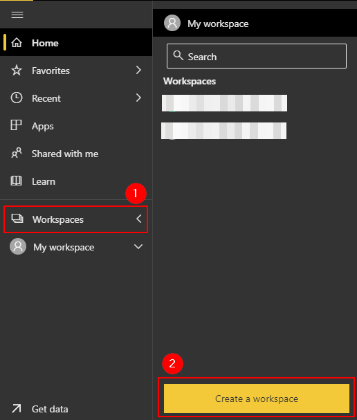

4. **Copy** the workspace id. You can get this by browsing to https://app.powerbi.com/ selecting the workspace and then copying the id in the address URL.

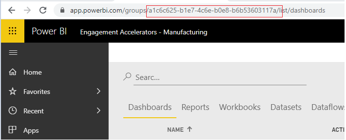

### Task 3: Deploy the ARM Template

1. **Deploy** the Azure resources through the following Azure ARM template (**press/click** the button "Deploy to Azure"):

    <a href="https://portal.azure.com/#create/Microsoft.Template/uri/https%3A%2F%2Fraw.githubusercontent.com%2Fmicrosoft%2FAzure-Analytics-and-AI-Engagement%2Freal-time%2F
Manufacturing%2Fautomation%2FmainTemplate-shell.json" target="_blank"></a>

2. On the Custom deployment form, **select** your desired subscription.
3. **Enter** a resource group name.
4. **Provide** a Unique Suffix.
5. **Enter** the target Power BI Workspace.  You can get this by browsing to https://app.powerbi.com/, selecting a workspace and then copying the **id** in the address url.

    

6. Finally, **provide** a strong SQL Administrator Login Password.

    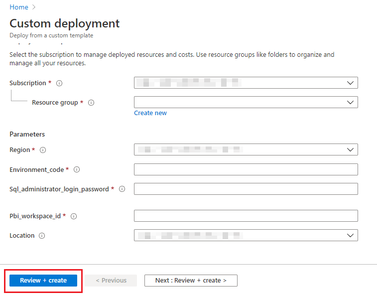
  
    > **Important**: The `location` field under 'Settings' will list the Azure regions where Azure Synapse Analytics (Preview) is available as of June 2020. This will help you find a region where the service is available without being limited to where the resource group is defined.

7. **Click** on the  Review + Create button. Azure will validate your template.
8. After the validation has passed, **click** on the Create button and the template deployment will begin.

> **NOTE** The provisioning of your deployment resources will take approximately 20 minutes.

9. Confirm that the deployment has succeeded before proceeding to the next step.
    
    

### Task 4: Run the Cloud Shell 

1. **Open** the Azure Portal.
2. In the Azure Portal, **open** the Azure Cloud Shell by selecting its icon from the right side of the top toolbar.

    

    > **Note**: If you are prompted to choose a shell, select **Powershell**, and if asked to create a **storage account** for the Azure Cloud Shell, agree to have it created.
    
    

3. In the Azure Cloud Shell window, **enter** the following command to clone the repository files.

    ```PowerShell
    git clone -b real-time https://github.com/microsoft/Azure-Analytics-and-AI-Engagement.git MfgAI
    ```
    
    
    
    > **Note**: When executing the script below, it is important to let the scripts run to completion. Some tasks may take longer than others to run. When a script completes     execution, you will be returned to a command prompt. The total runtime of all steps in this task will take approximately 15 minutes.

4. **Execute** the manufacturingSetup-shell.ps1 script by executing the following command:

    ```PowerShell
    cd 'MfgAI/Manufacturing/automation'
    ./manufacturingSetup-shell.ps1
    ```
    
5. **Click** on the link provided in the shell console and **copy** the code. It will open a new browser window, provide the code to get authenticated.


6. You will get another set of code to authenticate the device, **copy** the code.


7. You will now be prompted to **enter** the resource group name in the Azure Cloud Shell.


8. **Pass** the final set of authentication codes provided on the Azure Cloud Shell. 


 > **Note**: Make sure to provide the device code in time before it gets expired and let the script run till completion.

### Task 5: Power BI reports and Dashboard creation 

1. **Open** Power BI Services In a new Tab using following link Power BI Link:  https://app.powerbi.com/

2. **Sign in**, to Power BI account using Power BI Pro account.

> **Note**: Please use the same credentials for Power BI which you have used for Azure ARM + PowerShell deployment.


3. Once the above deployment is complete, we can see a set of reports in the reports tab, Realtime datasets in dataset tab. We can create a Power BI Dashboard by pinning visuals from the reports. 

> **Note:** A dashboard is a collection of tiles/visualisation which are pinned from different reports on a single page where key KPI of business are defined.

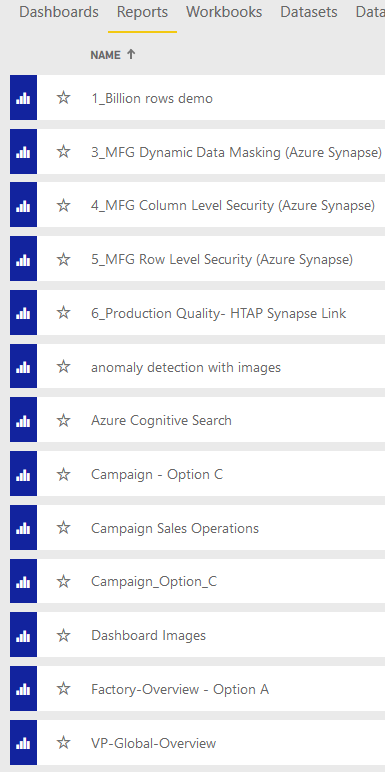

4. **Authenticate** the Power BI reports to access the datasources.
5. **Click** to settings icon on top right-side corner.
6. **Select** settings


7. **Go to** Datasets tab


8. **Select** Campaign – Option C Report
9. **Expand** Data Source Credentials
10. **Click** Edit Credentials


11. Configure Campaign - Option C dialogue box will pop up
12. **Enter** Username as ‘ManufacturingUser’ 
13. **Enter** the same Password which was used while azure deployment
14. **Click** Sign in


15. Follow the below steps for dashboard creation:
* **Select** workspace ‘Engagement Accelerators-Manufacturing’.

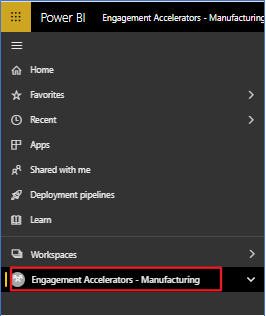

* **Click** on “+Create” button present on the top- right navigation bar.
* **Select** “Dashboard” option from the drop-down menu.


* **Name** dashboard as ‘Engagement Accelerators Dashboard’ and **click** “create”.
* The created Dashboard will appear in the Dashboard section.

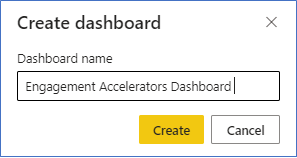

* **Click** on “Reports” section/tab.


* On the “Report” section, there will be a list of all the published reports. 
* **Select/Click** on ‘Campaign- Option C’ Report.


* On the individual report page, **select** ‘Revenue Vs Target’ visual and **click** the pin icon.


* **Select** “Existing dashboard” radio button. 
* **From** “select existing dashboard” dropdown, **select** ‘Engagement Accelerators Dashboard’.
* **Click** “Pin”. 
* The visual will be pinned and visible on the dashboard. 
* Similarly, different visuals from different reports can be pinned on the same Dashboard.

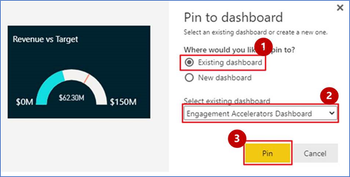

* To pin any image on the dashboard, **select** the report “Dashboard Images” which has images on it from the reports section.

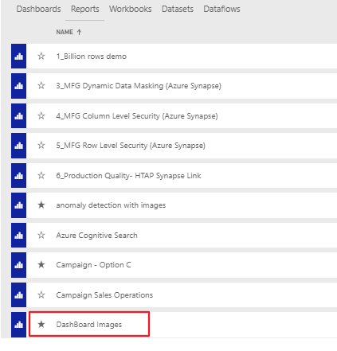

* On the individual report which has images incorporated in it, **select/click** any image, and click on the pin icon.


* **Select** existing dashboard radio button and select the name of recently created dashboard.
* **Click** on Pin. 
* The image will be pinned and visible on the same dashboard. 
* Similarly, different images can be pinned on the Dashboard.

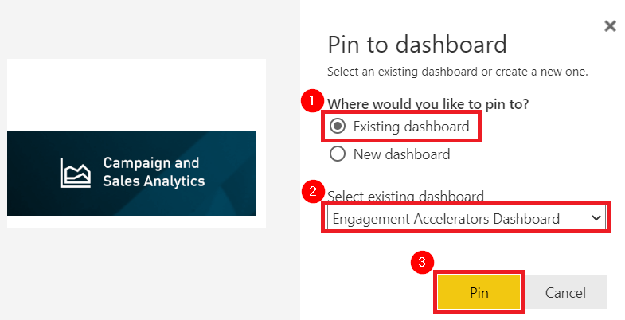

* To refer the Pinned Visuals, **click** on the “Dashboards” section. 
* **Select** ‘Engagement Accelerators Dashboard’ which has the pinned visuals. 


* **Refer** the screenshot of the dashboard and observe the pinned visuals.

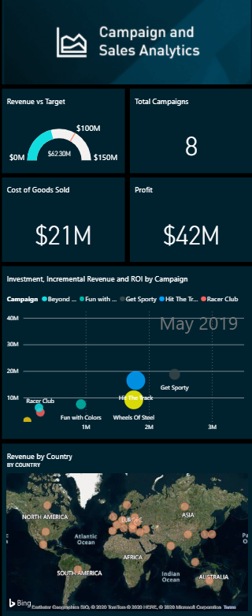

* Follow the same procedure to pin ‘Predictive maintenance and Safety Analytics’ pillar tiles to dashboard using ‘anomaly detection with images’ report.


* We can achieve the given look and feel by pining the visuals and images from different reports on to the same dashboard (you can tweak with different elements such as           backgrounds and themes as well).

> **Note:** Real-Time reports will not be deployed as part of ARM template deployment. We need to create real-time reports as per task 6.


### Task 6:  Working with Power BI for Real Time Report

‘Racing Cars’ and ‘milling canning’ Datasets will be automatically created when Azure Stream Analytics jobs will start sending data into Power BI services.
 Once dataset has been created in Power BI workspace, please follow the next step to create ‘Racing Cars- A’ Power BI Report.

1. **Click** on ‘+Create’ button present on the top navigation bar.
2. **Select** ‘Report’ option from the drop-down menu.


3. **Search** for ‘Racing’ dataset.
4. **Select** ‘Racing Cars’ dataset in the workspace created.


5. To **create** ‘Active Sensors’ Visualization which is the Average of Active Sensors, **Select** the Card icon from Visualization tray.

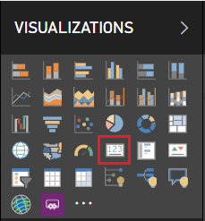

6. **Select** ActiveSensors field from race-cars dataset. 
7. **Select** drop- down next to ActiveSensors.
8. **Select** Average from the drop- down to get average of ActiveSensors.

 

9. With Card visual selected, **Go to** format tab.
10. **Turn on** the title.
11. **Write** Active Sensors as title for the card.


12. **Turn on** Background and change the background color of card.
Similarly, color of KPI value and Title value can be changed from Data label and Title respectively.

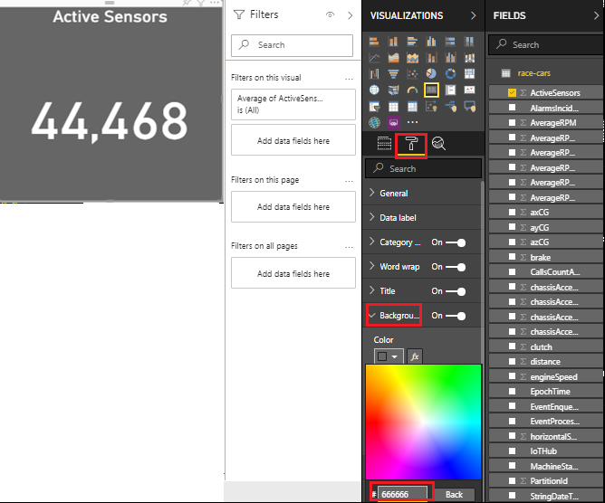

In the similar manner all other visuals of the report can be created. By following the same process for ‘milling canning’ dataset we can create following real-time reports
    • Milling Canning report
    • Maintenance and cost Analytics 
    • Miami Racing cars
 
Once these Realtime reports are ready we can pin it to dashboard (by following the procedure explained in Task 5) to finally achieve the following look and feel.

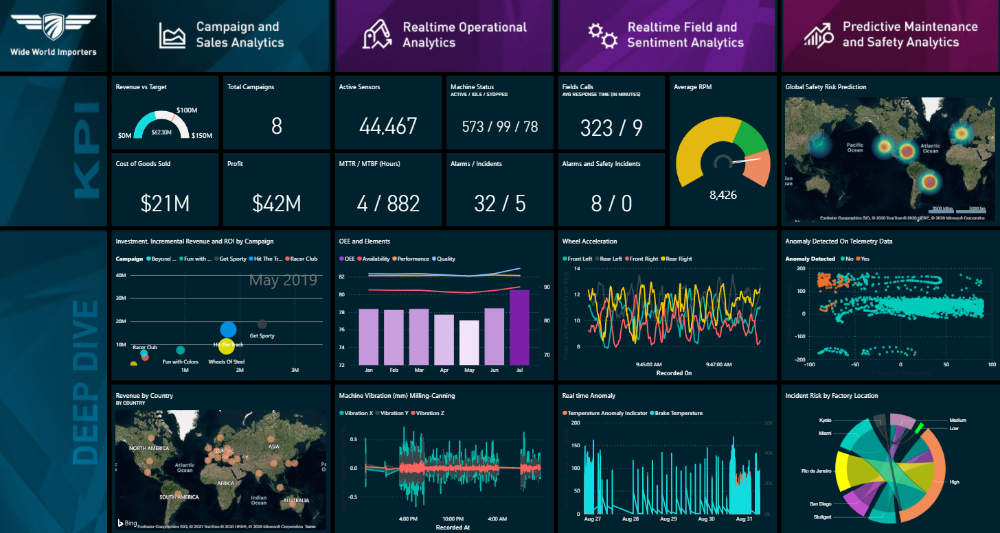    
